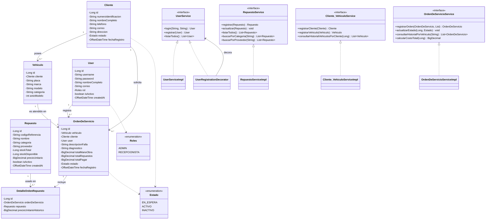
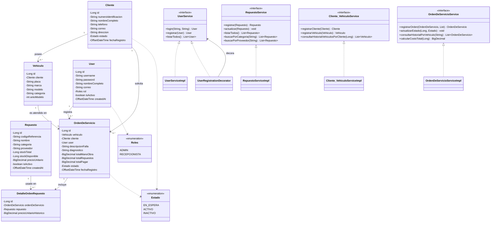
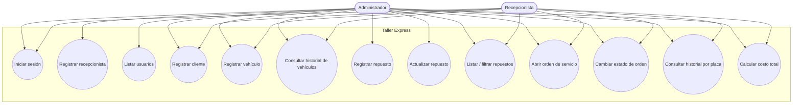

# Taller Express

Sistema de gestión para talleres mecánicos, desarrollado en **Java** con arquitectura en capas (presentación, controlador, servicio, repositorio y dominio) y persistencia en **PostgreSQL** mediante JDBC.

## Descripción general

Taller Express permite administrar el flujo completo de un taller automotriz:

- **Usuarios**: autenticación (login) y registro de recepcionistas mediante el patrón *Decorator* (`UserRegistrationDecorator`), que asigna automáticamente rol, estado activo y fecha de creación.
- **Clientes y Vehículos**: registro de clientes, asociación de vehículos y consulta del historial vehicular por cliente.
- **Repuestos**: alta, actualización, listado y filtrado por categoría o proveedor, con control de stock.
- **Órdenes de Servicio**: apertura de órdenes con diagnóstico, mano de obra y repuestos asociados; cambio de estado (`EN_ESPERA`, `ACTIVO`, `INACTIVO`); consulta de historial técnico por placa; y cálculo del costo total a cobrar (mano de obra + repuestos).

La interfaz de usuario se implementa con **Swing** utilizando cuadros de diálogo (`JOptionPane`), y la capa de acceso a datos utiliza `PreparedStatement` con `RETURN_GENERATED_KEYS` para persistencia en PostgreSQL.

### Arquitectura por capas

```
presentation/  → Vistas con JOptionPane (interacción con el usuario)
controller/    → Orquesta llamadas a servicios y estandariza respuestas (Respuesta<T>)
service/       → Reglas de negocio (interfaces + implementaciones en /impl)
repository/    → Contratos de acceso a datos (interfaces + implementaciones JDBC en /jdbc)
domain/
  models/      → Entidades con validaciones internas (Cliente, Vehiculo, Repuesto, User, OrdenDeServicio, DetalleOrdenRepuesto)
  enums/       → Estado, Roles
  exceptions/  → DatosInvalidosException, EntidadDuplicadaException, EntidadNoEncontradaException, ReglaNegocioException
```

## Requisitos previos

| Herramienta | Versión mínima | Notas |
|---|---|---|
| **Java (JDK)** | 21 | Definido en `pom.xml` (`maven.compiler.release`) |
| **Maven** | 3.8+ | Gestión de dependencias y build |
| **PostgreSQL** | 12+ | Motor de base de datos |
| **Driver JDBC** | `org.postgresql:postgresql:42.7.2` | Se descarga automáticamente vía Maven |

## Configuración de la base de datos

1. Crea la base de datos:

   ```sql
   CREATE DATABASE taller_db;
   ```

2. Crea las tablas principales (ajusta tipos/nombres si tu esquema difiere):

   ```sql
   CREATE TABLE users (
       id SERIAL PRIMARY KEY,
       username VARCHAR(50) UNIQUE NOT NULL,
       password VARCHAR(255) NOT NULL,
       nombre_completo VARCHAR(150) NOT NULL,
       correo VARCHAR(150) NOT NULL,
       rol VARCHAR(20) NOT NULL,           -- 'ADMIN' | 'RECEPCIONISTA'
       is_activo BOOLEAN NOT NULL DEFAULT TRUE,
       created_at TIMESTAMPTZ NOT NULL DEFAULT NOW()
   );

   CREATE TABLE clientes (
       id SERIAL PRIMARY KEY,
       numero_identificacion VARCHAR(30) NOT NULL,
       nombre_completo VARCHAR(150) NOT NULL,
       telefono VARCHAR(30) NOT NULL,
       correo VARCHAR(150) NOT NULL,
       direccion VARCHAR(200) NOT NULL,
       estado VARCHAR(20) NOT NULL,        -- 'EN_ESPERA' | 'ACTIVO' | 'INACTIVO'
       fecha_registro TIMESTAMPTZ NOT NULL DEFAULT NOW()
   );

   CREATE TABLE vehiculos (
       id SERIAL PRIMARY KEY,
       cliente_id INTEGER NOT NULL REFERENCES clientes(id),
       placa VARCHAR(15) UNIQUE NOT NULL,
       marca VARCHAR(50) NOT NULL,
       modelo VARCHAR(50) NOT NULL,
       categoria VARCHAR(50) NOT NULL,
       anio_modelo INTEGER NOT NULL
   );

   CREATE TABLE repuestos (
       id SERIAL PRIMARY KEY,
       codigo_referencia VARCHAR(30) NOT NULL,
       nombre VARCHAR(100) NOT NULL,
       categoria VARCHAR(50) NOT NULL,
       proveedor VARCHAR(100) NOT NULL,
       stock_total BIGINT NOT NULL,
       stock_disponible BIGINT NOT NULL,
       precio_unitario NUMERIC(12,2) NOT NULL,
       is_activo BOOLEAN NOT NULL DEFAULT TRUE,
       created_at TIMESTAMPTZ NOT NULL DEFAULT NOW()
   );

   CREATE TABLE ordenes_servicio (
       id SERIAL PRIMARY KEY,
       vehiculo_id INTEGER NOT NULL REFERENCES vehiculos(id),
       cliente_id INTEGER NOT NULL REFERENCES clientes(id),
       user_id INTEGER NOT NULL REFERENCES users(id),
       descripcion_falla TEXT NOT NULL,
       diagnostico TEXT NOT NULL,
       total_mano_obra NUMERIC(12,2) NOT NULL,
       total_repuestos NUMERIC(12,2) NOT NULL,
       total_pagar NUMERIC(12,2) NOT NULL,
       estado VARCHAR(20) NOT NULL,
       fecha_registro TIMESTAMPTZ NOT NULL DEFAULT NOW()
   );

   CREATE TABLE detalle_orden_repuestos (
       id SERIAL PRIMARY KEY,
       orden_servicio_id INTEGER NOT NULL REFERENCES ordenes_servicio(id),
       repuesto_id INTEGER NOT NULL REFERENCES repuestos(id),
       precio_unitario_historico NUMERIC(12,2) NOT NULL
   );
   ```

3. Crea un usuario administrador inicial para poder iniciar sesión:

   ```sql
   INSERT INTO users (username, password, nombre_completo, correo, rol, is_activo, created_at)
   VALUES ('admin_taller', '1234', 'Administrador', 'admin@tallerexpress.com', 'ADMIN', TRUE, NOW());
   ```

4. Actualiza las credenciales de conexión en `TallerExpress.java` si es necesario:

   ```java
   String url = "jdbc:postgresql://localhost:5434/taller_db";
   String userDB = "postgres";
   String passDB = "yamitgc01";
   ```

## Pasos de configuración y ejecución

1. **Clonar el repositorio**

   ```bash
   git clone https://github.com/YamitGC/tallerexpress
   cd tallerexpress
   ```

2. **Compilar el proyecto con Maven**

   ```bash
   mvn clean compile
   ```

3. **Verificar/crear la base de datos** siguiendo la sección anterior.

4. **Ejecutar la aplicación**

   Desde NetBeans: abrir el proyecto y ejecutar `TallerExpress.java` (clase `main`).

   Desde línea de comandos con Maven:

   ```bash
   mvn exec:java -Dexec.mainClass="com.mycompany.tallerexpress.TallerExpress"
   ```

5. **Iniciar sesión** con las credenciales creadas en el paso de base de datos.

6. Navegar por el **Panel de Control** entre los módulos: Repuestos, Clientes y Vehículos, Usuarios, Órdenes de Servicio.

## Capturas de pantalla (JOptionPane)

> Las siguientes capturas deben tomarse ejecutando la aplicación y guardarse en una carpeta `docs/screenshots/` del repositorio. Reemplaza las rutas de ejemplo por tus imágenes reales.

| Pantalla | Descripción | Imagen |
|---|---|---|
| Login | Autenticación de usuario (`ejecutarLogin`) | `docs/screenshots/login.png` |
| Panel de Control | Menú principal de módulos | `docs/screenshots/panel-control.png` |
| Registrar Cliente | Formulario de alta de cliente | `docs/screenshots/registrar-cliente.png` |
| Registrar Vehículo | Formulario de alta de vehículo | `docs/screenshots/registrar-vehiculo.png` |
| Historial Vehicular | Tabla de vehículos por cliente | `docs/screenshots/historial-vehiculos.png` |
| Registrar Repuesto | Formulario de alta de repuesto | `docs/screenshots/registrar-repuesto.png` |
| Listado de Repuestos | Tabla con filtros por categoría/proveedor | `docs/screenshots/listado-repuestos.png` |
| Crear Orden de Servicio | Formulario de apertura de orden | `docs/screenshots/crear-orden.png` |
| Cambiar Estado de Orden | Selector de nuevo estado | `docs/screenshots/cambiar-estado.png` |
| Liquidación Financiera | Cálculo del total a cobrar | `docs/screenshots/liquidacion.png` |

Ejemplo de inserción de imagen en Markdown:

```markdown

```

## Diagrama de clases



## Diagrama de casos de uso


> **Nota:** los diagramas están escritos en sintaxis [Mermaid](https://mermaid.js.org/) y se renderizan automáticamente en GitHub, GitLab y la mayoría de visores de Markdown. Si tu visor no los soporta, puedes generarlos como imagen con [mermaid.live](https://mermaid.live/) y reemplazar los bloques de código por ``.

## Estructura del proyecto

```
src/main/java/com/mycompany/tallerexpress/
├── config/            # Configuración de base de datos
├── controller/        # Controladores (orquestan servicios, retornan Respuesta<T>)
├── domain/
│   ├── enums/          # Estado, Roles
│   ├── exceptions/      # Excepciones de negocio y validación
│   └── models/          # Entidades del dominio
├── presentation/       # Vistas Swing (JOptionPane)
├── repository/         # Interfaces de repositorio
│   └── jdbc/            # Implementaciones JDBC (PostgreSQL)
├── service/             # Interfaces de servicio
│   └── impl/             # Implementaciones + Decorator de registro de usuarios
└── TallerExpress.java   # Punto de entrada / composición de dependencias
```

## Tecnologías utilizadas

- Java 21
- Maven
- PostgreSQL + JDBC (`postgresql:42.7.2`)
- Swing (`JOptionPane`) para la interfaz de usuario
- Patrones de diseño: **Decorator** (registro de usuarios con valores por defecto), capas repositorio/servicio/controlador/presentación# Taller Express

Sistema de gestión para talleres mecánicos, desarrollado en **Java** con arquitectura en capas (presentación, controlador, servicio, repositorio y dominio) y persistencia en **PostgreSQL** mediante JDBC.

## Descripción general

Taller Express permite administrar el flujo completo de un taller automotriz:

- **Usuarios**: autenticación (login) y registro de recepcionistas mediante el patrón *Decorator* (`UserRegistrationDecorator`), que asigna automáticamente rol, estado activo y fecha de creación.
- **Clientes y Vehículos**: registro de clientes, asociación de vehículos y consulta del historial vehicular por cliente.
- **Repuestos**: alta, actualización, listado y filtrado por categoría o proveedor, con control de stock.
- **Órdenes de Servicio**: apertura de órdenes con diagnóstico, mano de obra y repuestos asociados; cambio de estado (`EN_ESPERA`, `ACTIVO`, `INACTIVO`); consulta de historial técnico por placa; y cálculo del costo total a cobrar (mano de obra + repuestos).

La interfaz de usuario se implementa con **Swing** utilizando cuadros de diálogo (`JOptionPane`), y la capa de acceso a datos utiliza `PreparedStatement` con `RETURN_GENERATED_KEYS` para persistencia en PostgreSQL.

### Arquitectura por capas

```
presentation/  → Vistas con JOptionPane (interacción con el usuario)
controller/    → Orquesta llamadas a servicios y estandariza respuestas (Respuesta<T>)
service/       → Reglas de negocio (interfaces + implementaciones en /impl)
repository/    → Contratos de acceso a datos (interfaces + implementaciones JDBC en /jdbc)
domain/
  models/      → Entidades con validaciones internas (Cliente, Vehiculo, Repuesto, User, OrdenDeServicio, DetalleOrdenRepuesto)
  enums/       → Estado, Roles
  exceptions/  → DatosInvalidosException, EntidadDuplicadaException, EntidadNoEncontradaException, ReglaNegocioException
```

## Requisitos previos

| Herramienta | Versión mínima | Notas |
|---|---|---|
| **Java (JDK)** | 21 | Definido en `pom.xml` (`maven.compiler.release`) |
| **Maven** | 3.8+ | Gestión de dependencias y build |
| **PostgreSQL** | 12+ | Motor de base de datos |
| **Driver JDBC** | `org.postgresql:postgresql:42.7.2` | Se descarga automáticamente vía Maven |

## Configuración de la base de datos

1. Crea la base de datos:

   ```sql
   CREATE DATABASE taller_db;
   ```

2. Crea las tablas principales (ajusta tipos/nombres si tu esquema difiere):

   ```sql
   CREATE TABLE users (
       id SERIAL PRIMARY KEY,
       username VARCHAR(50) UNIQUE NOT NULL,
       password VARCHAR(255) NOT NULL,
       nombre_completo VARCHAR(150) NOT NULL,
       correo VARCHAR(150) NOT NULL,
       rol VARCHAR(20) NOT NULL,           -- 'ADMIN' | 'RECEPCIONISTA'
       is_activo BOOLEAN NOT NULL DEFAULT TRUE,
       created_at TIMESTAMPTZ NOT NULL DEFAULT NOW()
   );

   CREATE TABLE clientes (
       id SERIAL PRIMARY KEY,
       numero_identificacion VARCHAR(30) NOT NULL,
       nombre_completo VARCHAR(150) NOT NULL,
       telefono VARCHAR(30) NOT NULL,
       correo VARCHAR(150) NOT NULL,
       direccion VARCHAR(200) NOT NULL,
       estado VARCHAR(20) NOT NULL,        -- 'EN_ESPERA' | 'ACTIVO' | 'INACTIVO'
       fecha_registro TIMESTAMPTZ NOT NULL DEFAULT NOW()
   );

   CREATE TABLE vehiculos (
       id SERIAL PRIMARY KEY,
       cliente_id INTEGER NOT NULL REFERENCES clientes(id),
       placa VARCHAR(15) UNIQUE NOT NULL,
       marca VARCHAR(50) NOT NULL,
       modelo VARCHAR(50) NOT NULL,
       categoria VARCHAR(50) NOT NULL,
       anio_modelo INTEGER NOT NULL
   );

   CREATE TABLE repuestos (
       id SERIAL PRIMARY KEY,
       codigo_referencia VARCHAR(30) NOT NULL,
       nombre VARCHAR(100) NOT NULL,
       categoria VARCHAR(50) NOT NULL,
       proveedor VARCHAR(100) NOT NULL,
       stock_total BIGINT NOT NULL,
       stock_disponible BIGINT NOT NULL,
       precio_unitario NUMERIC(12,2) NOT NULL,
       is_activo BOOLEAN NOT NULL DEFAULT TRUE,
       created_at TIMESTAMPTZ NOT NULL DEFAULT NOW()
   );

   CREATE TABLE ordenes_servicio (
       id SERIAL PRIMARY KEY,
       vehiculo_id INTEGER NOT NULL REFERENCES vehiculos(id),
       cliente_id INTEGER NOT NULL REFERENCES clientes(id),
       user_id INTEGER NOT NULL REFERENCES users(id),
       descripcion_falla TEXT NOT NULL,
       diagnostico TEXT NOT NULL,
       total_mano_obra NUMERIC(12,2) NOT NULL,
       total_repuestos NUMERIC(12,2) NOT NULL,
       total_pagar NUMERIC(12,2) NOT NULL,
       estado VARCHAR(20) NOT NULL,
       fecha_registro TIMESTAMPTZ NOT NULL DEFAULT NOW()
   );

   CREATE TABLE detalle_orden_repuestos (
       id SERIAL PRIMARY KEY,
       orden_servicio_id INTEGER NOT NULL REFERENCES ordenes_servicio(id),
       repuesto_id INTEGER NOT NULL REFERENCES repuestos(id),
       precio_unitario_historico NUMERIC(12,2) NOT NULL
   );
   ```

3. Crea un usuario administrador inicial para poder iniciar sesión:

   ```sql
   INSERT INTO users (username, password, nombre_completo, correo, rol, is_activo, created_at)
   VALUES ('admin_taller', '1234', 'Administrador', 'admin@tallerexpress.com', 'ADMIN', TRUE, NOW());
   ```

4. Actualiza las credenciales de conexión en `TallerExpress.java` si es necesario:

   ```java
   String url = "jdbc:postgresql://localhost:5434/taller_db";
   String userDB = "postgres";
   String passDB = "yamitgc01";
   ```

## Pasos de configuración y ejecución

1. **Clonar el repositorio**

   ```bash
   git clone <url-del-repositorio>
   cd TallerExpress
   ```

2. **Compilar el proyecto con Maven**

   ```bash
   mvn clean compile
   ```

3. **Verificar/crear la base de datos** siguiendo la sección anterior.

4. **Ejecutar la aplicación**

   Desde NetBeans: abrir el proyecto y ejecutar `TallerExpress.java` (clase `main`).

   Desde línea de comandos con Maven:

   ```bash
   mvn exec:java -Dexec.mainClass="com.mycompany.tallerexpress.TallerExpress"
   ```

5. **Iniciar sesión** con las credenciales creadas en el paso de base de datos.

6. Navegar por el **Panel de Control** entre los módulos: Repuestos, Clientes y Vehículos, Usuarios, Órdenes de Servicio.

## Capturas de pantalla (JOptionPane)

> Las siguientes capturas deben tomarse ejecutando la aplicación y guardarse en una carpeta `docs/screenshots/` del repositorio. Reemplaza las rutas de ejemplo por tus imágenes reales.

| Pantalla | Descripción | Imagen |
|---|---|---|
| Login | Autenticación de usuario (`ejecutarLogin`) | `docs/screenshots/login.png` |
| Panel de Control | Menú principal de módulos | `docs/screenshots/panel-control.png` |
| Registrar Cliente | Formulario de alta de cliente | `docs/screenshots/registrar-cliente.png` |
| Registrar Vehículo | Formulario de alta de vehículo | `docs/screenshots/registrar-vehiculo.png` |
| Historial Vehicular | Tabla de vehículos por cliente | `docs/screenshots/historial-vehiculos.png` |
| Registrar Repuesto | Formulario de alta de repuesto | `docs/screenshots/registrar-repuesto.png` |
| Listado de Repuestos | Tabla con filtros por categoría/proveedor | `docs/screenshots/listado-repuestos.png` |
| Crear Orden de Servicio | Formulario de apertura de orden | `docs/screenshots/crear-orden.png` |
| Cambiar Estado de Orden | Selector de nuevo estado | `docs/screenshots/cambiar-estado.png` |
| Liquidación Financiera | Cálculo del total a cobrar | `docs/screenshots/liquidacion.png` |

Ejemplo de inserción de imagen en Markdown:

```markdown

```

## Diagrama de clases



## Diagrama de casos de uso



> **Nota:** los diagramas están escritos en sintaxis [Mermaid](https://mermaid.js.org/) y se renderizan automáticamente en GitHub, GitLab y la mayoría de visores de Markdown. Si tu visor no los soporta, puedes generarlos como imagen con [mermaid.live](https://mermaid.live/) y reemplazar los bloques de código por ``.

## Estructura del proyecto

```
src/main/java/com/mycompany/tallerexpress/
├── config/            # Configuración de base de datos
├── controller/        # Controladores (orquestan servicios, retornan Respuesta<T>)
├── domain/
│   ├── enums/          # Estado, Roles
│   ├── exceptions/      # Excepciones de negocio y validación
│   └── models/          # Entidades del dominio
├── presentation/       # Vistas Swing (JOptionPane)
├── repository/         # Interfaces de repositorio
│   └── jdbc/            # Implementaciones JDBC (PostgreSQL)
├── service/             # Interfaces de servicio
│   └── impl/             # Implementaciones + Decorator de registro de usuarios
└── TallerExpress.java   # Punto de entrada / composición de dependencias
```

## Tecnologías utilizadas

- Java 21
- Maven
- PostgreSQL + JDBC (`postgresql:42.7.2`)
- Swing (`JOptionPane`) para la interfaz de usuario
- Patrones de diseño: **Decorator** (registro de usuarios con valores por defecto), capas repositorio/servicio/controlador/presentaciónV